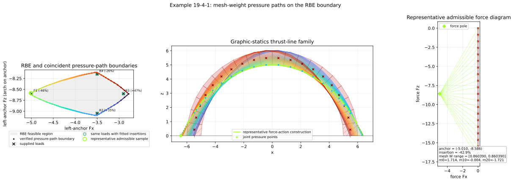
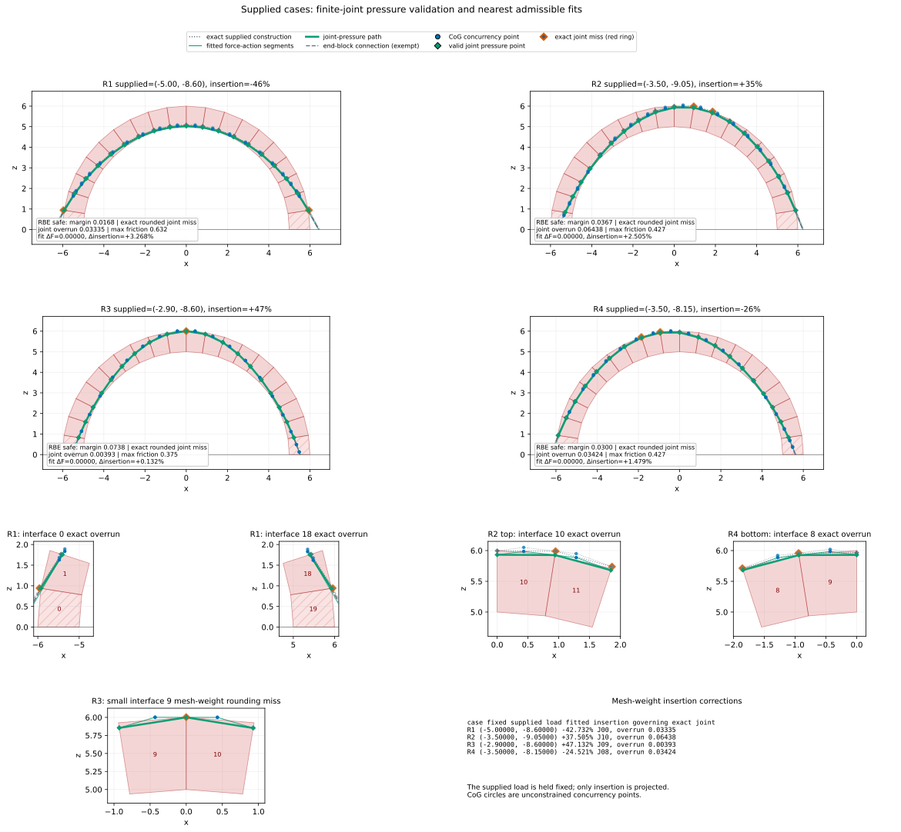

********************************************************************************
Full-Arch RBE Thrust-Line Family
********************************************************************************

This example extends :doc:`19_4_rbe_boundary_failure_modes_arch` with a
two-dimensional graphic-statics visualization. The gray load region comes from
the same tied, compression-only RBE model, while the form-diagram slopes come
from a separate force diagram.

The load plot uses the left-anchor reaction convention. A repository load
``(Fx, Fz)`` on the held rightmost block is displayed as ``(Fx, -Fz)`` at the
left anchor. This anchor vector is the force-diagram pole. A vertical chain of
mesh-volume weight steps supplies the directions of the form diagram. With
unit density, every block in this circular discretization weighs approximately
``0.860389558``. The former value ``0.863938`` came from the supplied screenshot
and is not used in the equilibrium reconstruction.

Pressure points and CoG concurrency
===================================

The form construction changes direction where the incoming and outgoing
resultant lines meet the vertical weight line through a block center of
gravity. This CoG turning point is a concurrency point used to satisfy block
moment equilibrium. It is not a contact point and does not have to lie inside
the corresponding block or inside the masonry.

The physical check is instead made where each resultant intersects a finite
joint. The classical line of thrust is the locus of these pressure points. This
is consistent with the pressure-point definition in `Block, DeJong, and
Ochsendorf (2006) <https://web.mit.edu/masonry/papers/block_dejong_ochs_NNJ.pdf>`_
and with the distinction between a funicular construction and a joint-pressure
load path discussed by `Alexakis and Makris
<https://journals.sagepub.com/doi/10.1177/10812865231183355>`_.

For each interface, the example calculates an intrados-to-extrados coordinate
``t`` and requires ``0 <= t <= 1`` within ``1e-9``. It also checks that the
normal component is compressive and that
``|Ft| / (0.7 Fn) <= 1``. Straight connections between consecutive pressure
points are drawn as an illustrative thrust path; because each interior block
is convex, a connection whose endpoints lie on its two finite joints remains
inside that block.

Blocks ``0`` and ``19`` may receive external support moments, so the
connections from their external anchors are shown as dashed, moment-exempt
segments. Their physical interfaces with blocks ``1`` and ``18`` are still
checked as finite joints.

Joint-admissible family
=======================

The example samples the RBE boundary from a verified feasible center in
``360`` polar directions. For every boundary load it solves the finite-joint
insertion interval and verifies compression and friction. With the exact mesh
weights, every sampled RBE-boundary load is also pressure-path admissible: the
colored pressure-path boundary therefore coincides with the gray RBE boundary.
There is no numerical or graphical inset. Every fourth sample contributes a
form construction so that the arch remains legible.

The representative construction shows three related objects: thin segments
with the force-diagram slopes, neutral-blue CoG concurrency points, and diamond
joint pressure points. The heavier line through the diamonds is the
pressure-point thrust path.

    The enlarged joint-admissible contour and its color-linked family inside
    the gray RBE safe-load region.

Supplied numerical cases
========================

The companion figure retains the supplied load and insertion values as
historical screenshot observations, but reconstructs them using the mesh
weights used by the RBE model. It does not trace screenshot pixels. Because the
screenshot used ``0.863938`` rather than ``0.860389558``, its CoG locations and
segment slopes are not regression targets for the corrected construction. All
four supplied loads are inside the RBE region and satisfy friction. Their exact
rounded insertion values produce these finite-joint results:

* ``R1 (-5.0, -8.6), -46%`` overruns interfaces ``0`` and ``18`` by
  ``0.03335`` and ``0.02785`` in normalized joint coordinates;
* ``R2 (-3.5, -9.05), +35%`` overruns interfaces ``10`` and ``11`` by
  ``0.06438`` and ``0.03380``;
* ``R3 (-2.9, -8.6), +47%`` overruns interface ``9`` by ``0.00393``;
* ``R4 (-3.5, -8.15), -26%`` overruns interfaces ``7`` and ``8`` by
  ``0.00719`` and ``0.03424``.

These small discrepancies are shown as rounding-level reconstruction misses,
not as CoG containment failures. The exact constructions remain faintly
visible, and red rings identify only joint pressure points outside a finite
interface. Neutral-blue CoG circles are never ringed.

The green reconstructions hold each supplied load fixed and project only its
insertion onto the mesh-weight admissible interval. They are approximately
``R1 (-5.0, -8.6), -42.732%``; ``R2 (-3.5, -9.05), +37.505%``;
``R3 (-2.9, -8.6), +47.132%``; and
``R4 (-3.5, -8.15), -24.521%``. Supplied and corrected insertions are reported
separately so that no measured value is silently replaced.

    Four complete reconstructions, zooms of the governing finite joints, and a
    numerical summary of the nearest admissible fits.

.. literalinclude:: 19_4_1_rbe_thrust_line_family_arch.py
    :language: python
