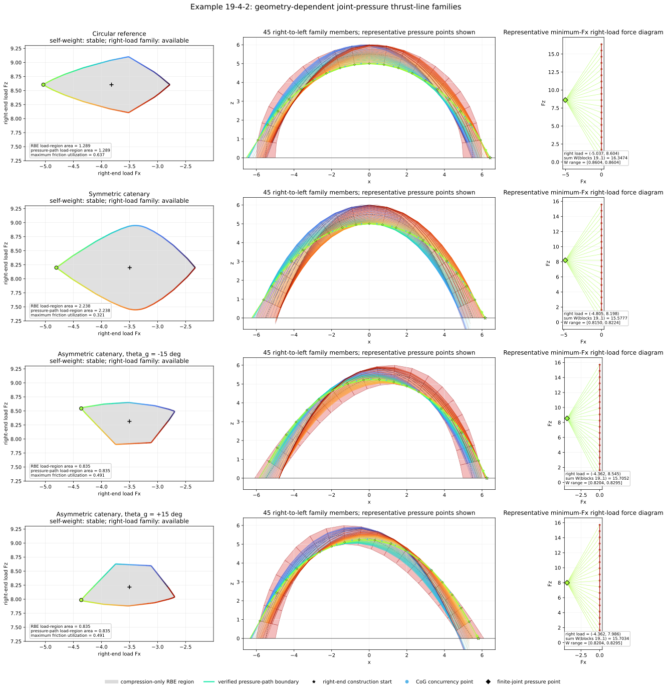
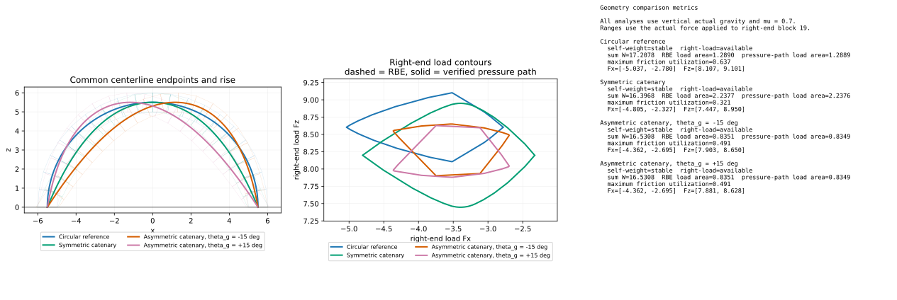

********************************************************************************
Thrust-Line Families for Circular and Catenary Arch Geometries
********************************************************************************

This example extends :doc:`19_4_1_rbe_thrust_line_family_arch` without changing
its circular-arch reconstruction. It compares the existing circular reference
with a symmetric catenary and a mirrored pair of asymmetric catenaries.

All four centerlines start at ``(-5.5, 0)``, end at ``(5.5, 0)``, and reach a
maximum ``z`` coordinate of ``5.5``. They use 20 blocks, unit orthogonal
thickness, unit depth, density ``1``, and friction coefficient ``0.7``.

Geometry generation
===================

The symmetric catenary is

.. math::

    z(x) = 5.5 - a\left[\cosh\left(\frac{x}{a}\right)-1\right],

where the endpoint condition gives ``a = 3.403175753`` approximately. The two
asymmetric profiles are generated in virtual-gravity coordinates with
``theta_g = -15 degrees`` and ``theta_g = +15 degrees``. Their solved constants
are approximately ``a = 3.170030635``, ``|u0| = 0.549381964``, and
``c = 8.898123755``. The angle is a geometry-generation parameter only: all
equilibrium analyses use vertical actual gravity.

Every profile is divided by equal centerline arc length. Joints are normal to
the centerline, and the intrados and extrados are offset by ``-0.5`` and
``+0.5`` along the same normal. The offset curves are extended by 10 percent
before their intersections with ``z = 0`` are found. The terminal voussoirs
therefore receive horizontal ground faces instead of artificial normal end
faces.

The RBE model uses the volume of each generated block as its weight. The force
polygon consequently has geometry-specific vertical steps; no catenary block
is assigned the circular reference weight merely to make the diagrams match.

Two meanings of stability
=========================

Two separate questions are reported for every geometry:

* **Self-weight stability** fixes both moment-capable terminal blocks and asks
  whether the remaining blocks have a compression-only, friction-admissible
  equilibrium under vertical weight alone.
* **Right-load family existence** fixes only block 0 and distributes a
  variable force across block 19's horizontal ground face, matching examples
  19-4 and 19-4-1. The plotted coordinates are that actual right-end force,
  and the thrust construction starts on the same side.

An arch could fail the first check but still be stabilizable by an end force;
the two statuses are therefore never combined. If the one-sided RBE set is
empty, unbounded, or contains no joint-admissible center, its geometry remains
visible but its row is labelled ``no joint-admissible right-load solution
space``.

Joint-pressure families
=======================

As in example 19-4-1, CoG turning points are concurrency points in the
funicular construction and are not constrained to their corresponding blocks.
Validity is checked at all 19 physical block-to-block joints. Every pressure
point must lie on its finite interface, its normal resultant must be
compressive, and its friction utilization must not exceed one.

For each geometry, 360 rays are traced from a verified joint-admissible center
to the RBE boundary. Every RBE-boundary sample is then reconstructed from the
right terminal block toward the fixed left block, traversing blocks ``19``
through ``1`` and interfaces ``18`` through ``0``. The force polygon uses the
actual right-end load as its pole and accumulates the mesh weights in the same
order. Block ``0`` is fixed, so its weight is not part of that free-body force
chain; its final connection is displayed only as a moment-exempt extension.

All sampled RBE-boundary forces pass the finite-joint, compression, and
friction checks. Consequently the pressure-path load-region boundary coincides
with the RBE load-region boundary within polar plotting resolution. The large
gray-only regions formerly shown for the asymmetric arches were caused by
reflecting a right-end RBE load into a left-anchor force diagram. They were not
friction failures. Every eighth result is plotted, giving 45 color-linked
right-to-left thrust lines per arch; the highlighted minimum-``Fx`` sample is
also shown in the adjacent weighted force diagram.

    Detailed comparison of load regions, arch thrust-line families, and
    geometry-specific weighted force diagrams.

    Compact overlay of the four geometries, their RBE and joint-admissible
    contours, and their stability and load-range metrics.

.. literalinclude:: 19_4_2_rbe_thrust_line_geometry_comparison.py
    :language: python
