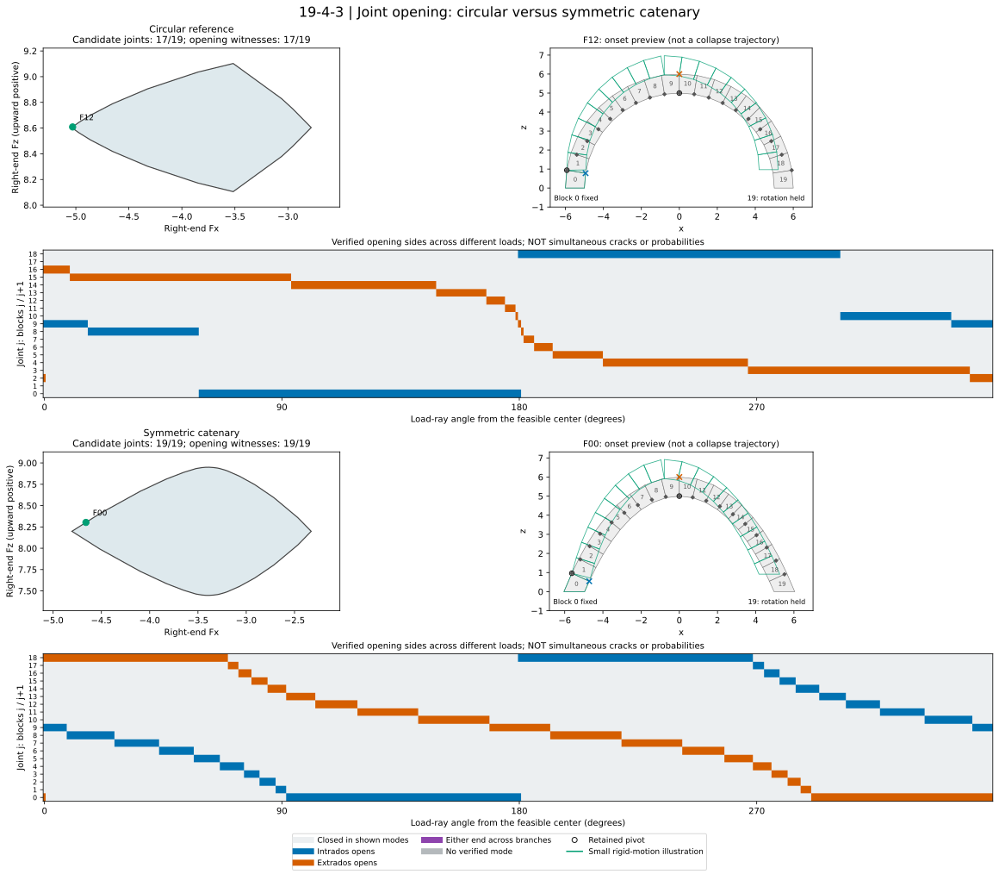

********************************************************************************
Joint Opening in Circular and Catenary Arches
********************************************************************************

This example compares the circular reference and symmetric catenary from
:doc:`19_4_2_rbe_thrust_line_geometry_comparison`, without modifying that example.
It separates **potential pivot locations** from **verified initial opening
motions**. A family overlays different loads: many possible opening locations
do not mean that all those joints crack simultaneously.

    Blue marks intrados opening; orange marks extrados opening. The opposite
    loaded endpoint remains a pivot. The lower maps show verified opening
    witnesses across different right-end loads, not probabilities.

:download:`Open or download the interactive, offline thrust-line and joint-opening viewer
<19_4_3_rbe_joint_opening_arch.html>`.
The viewer opens with the circular arch's **Thrust-line family**. Switch to
**Failure mode** to inspect the opening mechanism for the same locked load.

Exploring the linked views
==========================

In the family tab, **Whole family** overlays the sampled joint-pressure paths;
**Selected line** isolates the active path. Each path shares a color with its
load on the boundary. Hover near either a boundary point or an arch path to
preview the corresponding case, then click or tap to lock it. Leaving the plot
restores the locked selection. The dropdown and slider provide keyboard access
and distinguish paths that overlap. Cases follow angular order around the load
region; pointer selection uses the nearest computed case, without interpolating
mechanical results.

The family includes 360 boundary-ray samples, certified facet midpoints and
vertices. Coincident loads are shown once, preferring certified vertices so both
adjacent mechanism branches remain available. Each load uses the midpoint of its
admissible insertion interval, which is displayed alongside the selected insertion.
This is a sampled boundary-load family, not every interior load or every possible
insertion for each load.

Solid paths connect the physical joint-pressure diamonds. Dashed terminal
extensions represent the moment-exempt supports. **Show construction lines**
reveals only the selected load's funicular construction and blue concurrency
points. These points lie on the vertical CoG lines and need not be within the
masonry; finite-joint pressure points govern contact admissibility.

The failure tab retains the branch selector, enlarged motion-amplitude control,
opening-coverage map, and table of joint forces and normalized separation rates.
The locked case and branch are remembered for each geometry when switching tabs
or geometries. Each tab uses a fixed frame across all its cases, keeping selection
and amplitude changes from rescaling the arch. The HTML works offline in light
and dark themes, with plots stacked on narrow screens.

Model and support conditions
============================

Both arches retain the exact 20-block meshes, unit density and depth, vertical
gravity, mesh-volume weights and friction coefficient ``0.7`` from 19-4-2.
Block 0 is fully fixed. Block 19 can translate, but the right holder prevents
rotation and supplies a reaction moment. Its horizontal bottom face is the
external load-application face, **not an additional ground contact**. This is
the moment-capable holder interpretation of the projected right-end force
region. A force-only holder free to rotate would be a different problem.

The code starts with 360 primal support directions and checks every polygon
facet with another support LP. Missing facets are added until every support
discrepancy is at most ``1e-9``. Facet midpoints, vertices, and 360 ordered
boundary-ray samples are analyzed. Interfaces are ordered geometrically from
intrados to extrados, independently of their mesh vertex order.

Pressure limits versus opening
==============================

For pressure coordinate ``t`` along a joint and total normal force ``Fn``, the
equivalent endpoint normal forces are ``(1-t) Fn`` and ``t Fn``. These are
discrete resultant-equivalent contact forces, not a measured stress profile.
Compression, finite-joint position and friction are checked before any motion
is considered. The geometric feasibility tolerance remains ``1e-9``; a separate
``1e-7`` endpoint-fraction tolerance identifies numerically unloaded endpoints
and does not enlarge the load region.

When pressure reaches the intrados, the intrados can remain a pivot while the
extrados opens, and conversely. An unloaded endpoint is only a **candidate**:
its computed normal separation rate must be positive to call it opening.
In particular, polygon vertices admit multiple adjacent-facet branches; a
candidate endpoint can remain stationary in one branch and open in another.

The recomputed circular result has potential opening at 17 of its 19 joints,
not just at the crown. The symmetric catenary has witnesses for opening at both
ends of all 19 joints under different loads. These statements concern this
specific geometry and moment-capable holder, not every circular or catenary arch.

Compatible onset motion
=======================

Each free block has two translational and one planar rotational velocity.
The calculation enforces zero relative velocity at loaded endpoints,
nonnegative normal separation at unloaded endpoints, and zero rotation of
the right terminal block. The outward load perturbation selects the direction
of motion. Every reported mode is checked for contact compatibility,
force-gap complementarity, negligible boundary virtual work, and positive
outward-perturbation work. A zero endpoint force alone is never interpreted
as a displacement.

Friction remains below its limit for both default arches. If a case reaches
the friction limit, the opening-only preview is suppressed rather than
assuming a sliding law or interpreting an associative friction dual as actual
motion. Cases without a verified opening witness remain visible as contact
diagnostics.

The green preview uses exact rigid rotations about retained pivots, following
the initial angular-velocity ratios. Relative rotations are capped at ten
degrees, five times the original preview range, to make openings easier to see.
The amplitude is reduced if convex-polygon checks find interpenetration in any
of 101 sampled poses, retaining the original maximum angular sampling increment.
The viewer reports the actual maximum joint rotation and fits the entire motion
without changing zoom as the amplitude slider moves. The holder orientation and pivot
coincidence are preserved. These are **geometric onset illustrations**, not
equilibrated finite-displacement solutions, elapsed time, predicted crack widths,
or a simulated post-collapse trajectory. The script does not solve for new
forces in the displayed deformed geometry.

This is a dry-joint rigid-block model. It does not model elastic crack initiation,
fracture inside stones, material crushing, or impact/dynamic collapse. Force-line
extensions outside masonry are not used as opening criteria, and no extra
funicular containment constraint is introduced.

Background
==========

* `Block, DeJong and Ochsendorf, As Hangs the Flexible Chain: Equilibrium of
  Masonry Arches <https://web.mit.edu/masonry/papers/block_dejong_ochs_NNJ.pdf>`_,
  especially the discussion of hinges and spreading supports.
* `Alexakis and Makris, Vector analysis and the stationary potential energy for
  assessing equilibrium of curved masonry structures
  <https://journals.sagepub.com/doi/10.1177/10812865231183355>`_, section 3.3 on
  funicular lines versus the locus of joint-pressure points.

.. literalinclude:: 19_4_3_rbe_joint_opening_arch.py
    :language: python
